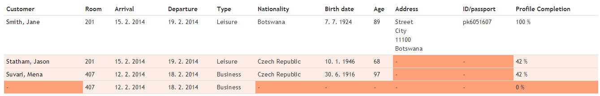
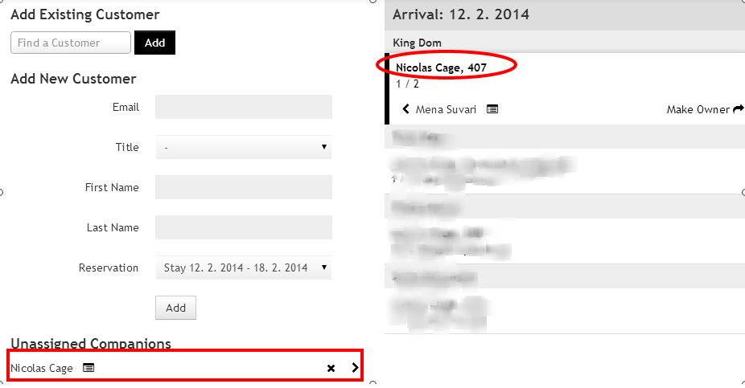

# Mews - Integration with Police CR

## Obsah

- [Úvod](#uvod)
- [Požadavky](#pozadavky)
- [Report Profily hostů](#report-profily-hostu)
   - [Nejčastejší problémy](#nejcastejsi-problemy)
      - [Řešení](#nejcastejsi-problemy-reseni)
- [Jak automatický reporting funguje](#jak-vse-funguje)
   - [Kteří hosté jsou reportováni](#kdo-je-reportovan)
   - [Co se děje v jeden den?](#jeden-den)
- [Rady na závěr](#rady-na-zaver)
- [Informace od Policie ČR](#informace-policie-cr)

## Úvod

Tento dokument slouží jako návod pro používání Automatického oznamování cizinců Cizinecké policii ČR. Základní informace, které poskytuje Policie ČR, jsou k dispozici na adrese http://e-uby.wz.cz/INFORMACE.htm. Tento dokument počítá s tím, že uživatel se s návodem Policie ČR seznámil.

## Požadavky

Pro nastavení v systému Mews je potřeba:
- Získat certifikát (digitální podpis) pro ověření posílaných emailů.
- Zaregistrovat se u Policie ČR a získat tak **IDUB** a **krátké IDUB** identifikátory hotelu a propojit hotel s emailovou adresou s digitálním podpisem.
- Uvést emailovou adresu, pod kterou je hotel zaregistrován u Policie ČR (na tento email bude Policie ČR posílat STANOVISKA k odeslaným seznamům, Mews na tento email bude posílat kopii odeslaného seznamu). Tento email by měl být stejný email, na který je vytvořen certifikát.
- Uvést alespoň jednu emailovou adresu, na kterou bude Mews posílat připomínku pro kontrolu reportu [Profily hostů](#report-profily-hostu).

## Report Profily hostů v Mews
Report Profily hostů (Customer Profiles) je možné zobrazit z úvodní stránky po přihlášení do systému Mews. Report zobrazuje seznam hostů, kteří jsou ubytovaní/kteří přijedou ve vybraný den. 

Takto vypadá příklad Cizineckého reportu. Ukazuje, že na pokoji 201 jsou ubytováni Jane Smith a Jason Statham, na pokoji 407 Mena Suvari a ještě někdo neudevený (rezervace je pro 2 osoby). 

Dále report říká, že
- Všechny potřebné údaje pro Jane Smith jsou vyplněny
- U Jasona Stathama a Mena Suvari chybí adresa a číslo pasu
- Společník Mena Suvari není uveden vůbec

Všechny chybějící (červené) údaje měly být vyplněny již běhěm Check-in procesu a do odeslání reportu musí být vyplněny. Cílem je mít všechny řádky bílé, tedy mít report vyplněn na 100%.

### Nejčastejší problémy

Ze začátku bývá nejtěžší vyřešit problém s neuvedeným hostem (případ pokoje 407). Mohlo nastat hned několik různých situací:

1. Druhý host nepřijel.
2. Druhý host přijel, ale nebyl v systému vytvořen nebo přiřazen k rezervaci.
3. Oba hosté přijeli, oba byli vytvořeni v systému. Host na reportu je ten „druhý“, ale na reportu chybí host, na kterého byla rezervace vytvořena.

#### Řešení

1. Stačí ručně upravit rezervaci tak, aby byla jen pro jednoho hosta a případně aplikovat nějaké poplatky. 
2. Stačí vytvořit nového hosta a přiřadit jej k rezervaci.
3. Nejdříve potřeba si uvědomit rozdíl mezi vlastníkem rezervace a hostem přiřazeným k rezervaci. Vlastník je ten, na jehož jméno je rezervace vytvořena. Může to být dokonce někdo, kdo do hotelu vůbec nepřijede, pouze pobyt pro někoho zarezervoval. Host je někdo, kdo přijel a kdo bydlí na daném pokoji.

Tento obrázek ukazuje, jak vyřešit třetí případ – pokoj 407 z prvního obrázku. Nicolas Cage je uveden jako vlastník rezervace (červená elipsa). Je potřeba jej ještě přidat na pokoj kliknutím na „>“ v červeném obdélníku. Tím se host přidá na vybraný pokoj. Jeden host může totiž objednat více pokojů a systém je automaticky nemůže přiřadit do všech zarezervovaných pokojů, protože jeden host nemůže být fyzicky ve dvou pokojích. Proto je potřeba tento krok udělat ručně při během Check-In procesu.

## Jak automatický reporting funguje

Pokud je na hotelu vše nastaveno (IDUB, Adresa, Emailové adresy, Certifikát nahrán), je vše připraveno pro automatické oznamování cizinců ubytovaných v hotelu. Tato operace běží automaticky na pozadí systému vždy v 9 hodin, a dělá dvě věci:

- Pošle upomínku na uvedený email s připomínkou, že je potřeba zkontrolovat report příjezdů za včerejší den.
- Vygeneruje se report za předvčerejší den a odešle jej Policii ČR.

### Kteří hosté jsou reportováni

Podle zákona se mají reportovat Polici všichní hosté s jinou, než Českou národností. Takže Mews do reportu, který posílá Policii, zahrne každého hosta s vypněnou národností (jinour, než Českou) **a to bez ohledu na to, jestli mu chybí vyplnit nějaký údaj**. Je to z toho důvodu, že kdyby recepční vyplňovali report po odeslání a přišla na hotel kontrola, tak kniha hostů bude vykazovat mnohem více cizinců, než bylo nahlášeno. Takže toto řešení donutí recepční vyplňovat vše včas. 

### Příklad nastavení
- Emailová adresa, na kterou hotel zařídil digitální podpis a pod kterým je hotel zaregistrován v systému Policie ČR je `hotel@hotel.com`.
- Emailové adresa, na které chodí upozornení na vyplnění hotelu jsou `recepce@hotel.com` a `manager@hotel.com`.

### Co se děje v jeden den?
Nyní je **17.2.2014 9:00** a stanou se následující věci:

- Mews pošle na uvedené adresy `recepce@hotel.com` a `manager@hotel.com` připomínku, že je potřeba zkontrolovat report [Profily hostů](#report-profily-hostu) za den **16.2.2014**. Je potřeba zkontrolovat, že report příjezdů v den **16.2.2014** je 100%, případně doplnit všechny chybějící informace. Předpokládá se, že všichni hosté, kteří měli přijet **16.2.2014** již přijeli, proto se kontroluje „včerejší“ den. Je potřeba tneto report do konce dne co nejvíce dokončit, protože během zítřka jej Mews automaticky odešle Policii.
- Mews automatiky vygeneruje a pošle Policii ČR report za „předvčerejší“ den **15.2.2014**, o kterém se předpokládá, že je zkontrolován z předchozího dne. Na kontrolu „včerejšího“ reportu na základě připomínky je tedy 24 hodin. Kopie reportu je odeslána na uvedený email `hotel@hotel.com`. **Je proto důležité, aby tento email někdo každý den četl a ujistil se, že Policie report přijala.**
- Policie ČR report zpracuje a pošle na stejný email (management@hotel.com) své STANOVISKO k reportu. Většinou to posílají ještě ten den, nejpozději do druhého pracovního dne.

## Stanoviska Policie ČR
**Stanovisko** je vyjádření Policie ČR k poslanému reportu a datum v něm obsažných. **Stanovisko** může být:

- Všechna data v pořádku, oznamovací povinnost BYLA splněna.
- Chybí některé drobnosti (křestní jméno, datum narození, …), přesto oznamovací povinnost BYLA splněna.
- Byly detekovány závažné chyby, proto oznamovací povinnost **NEBYLA** splněna. **V tomto případě je potřeba rychle reagovat, je proto důležité, aby uvedený email (`hotel@hotel.com`) někdo každý den četl a ujistil se, že v tomto případě budou data opravena a hned poslána Policii zpět.**

### Jak zacházet se STANOVISKY

- Pokud **Stanovisko** Policie ČR je jedno z prvních dvou případů, je vše v pořádku (v druhém případě je dobré opravit chybějící data v systému), není potřeba posílat opravený report. 
- Ve třetím případě je potřeba chyby opravit v systému a zároveň poslat opravený report - stačí v reportu [Profily hostů](#report-profily-hostu) vybrat příslušný den (**Pozor, stanoviska chodí na reporty poslné minimálně za 2 dny v minulosti** - viz [Jak automatický reporting funguje](#jak-vse-funguje)).

## Rady a připomínky na závěr

- Informovat všechny recepční, aby vyplňovali všechny potřebné údaje (Jméno, Příjemní, Datum narození, Národnost, Číslo pasu a Adresu bydliště), aby správně přiřadili všechny hosty na správný pokoj. 
- Je potřeba denně kontrolovat report na základě přijaté upomínky a důsledně vyřešit případné chybějící údaje během 24 hodin.- 
- Před prvním spuštění je potřeba zkontrolovat report za poslední 2 dny (od data spuštění), protože na ně nepřijde upomínkový email.
- Hosté s uvedenou národností jsou reportováni s nevyplněnými dalším údaji.

## Informace od Policie ČR
- Na [této adrese](http://e-uby.wz.cz/INFORMACE.htm) poskytuje Policie ČR informace pro uživatele systému **Oznamování cizinců ubytovateli**. 
- Zejména je vhodné seznámit se s články: 
   - Informace: 000, 006, 007 
   - FAQ: 008, 013, 016