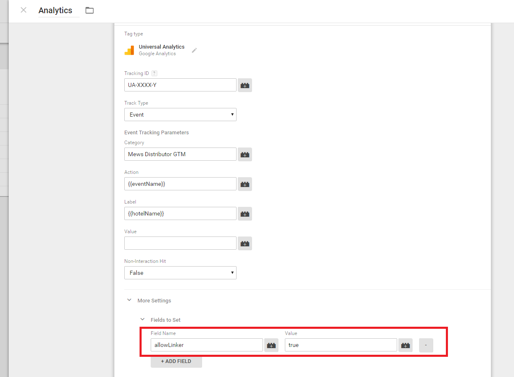

* TOC
{:toc}

## Install

### Script

Include the following script with embed-ready version of Distributor into your website.

~~~html
<script src="https://www.mews.li/distributor/distributor.min.js"></script>
~~~

The script should be included in `<head>` section and without `async` option. Size of the script is keeped as minimal as possible to allow quick initialization. A main widget script is then downloaded asynchronously and inserted automatically into your website afterwards.

Please note, that serving script from our servers ensures seamless release of new features and improvements. Do not therefore pack contents of this script file into your own javascript bundle and be sure to follow recommended way of including script via `<script>` HTML tag.

### Styles

Distributor Edge doesn't use separate css files, everything is packed inside the script. For possible customizations, consult [Customization](#customization) section.

## Usage

Once required script is loaded, you can initialize Distributor Edge with the following minimal code. Do not forget to **use hotelId of your hotel** instead of the sample hotelId `aaaa-bbbb-cccc-dddd-eeeeeeee`. This will create a separate overlay in your website and loads Distributor into it.

**Important:** The initialization needs to be called only after the website is loaded to ensure everything is ready. Easiest way to achieve this is to place it just before closing `</body>` tag.

The overlay is not visible by default - to actually show it to your users, you should bind its opening to some action (i.e. clicking on button). Distributor can do it automatically for you if you provide second option - a string of comma separated css selectors of elements, whose click event will be binded with opening of Distributor. The event is delegated, so you can pass selectors to elements that don't exist in website yet.

~~~html
<!-- Distributor's initialization call, creating new instance of Distributor. Use id of your hotel. -->
<script>
    Mews.Distributor({
        hotelIds: ['aaaa-bbbb-cccc-dddd-eeeeeeee'],
        openElements: '.open-distributor-button'
    });
</script>
~~~

If you need more specific setup of opening Distributor, or you want to call some api functions on Distributor instance, you can provide a callback function as second argument to initialization call - the instance is provided as an argument to the callback.

~~~html
<script>
    Mews.Distributor({
        hotelIds: ['aaaa-bbbb-cccc-dddd-eeeeeeee']
    }, function(distributor) {
        // you can call api functions on distributor instance here
    });
</script>
~~~

To see a list of all available api calls, please consult [API](#api) section.

Closing of Distributor is provided in the overlay by default, so you don't have to worry about that.

### Chain Distributor

Distributor can run in two basic modes - for *single* property or for *chain*. The mode is decided automatically during initialization based on the count of hotel IDs you provide in options. Whenever 2 or more hotels are loaded, the Distributor will be in *Chain* mode. That means that it will add one more step to the booking flow - hotel selection. To add more hotels, simple pass their ids into the `hotelIds` array option:

~~~html
<script>
    Mews.Distributor({
        hotelIds: [
            'aaaa-bbbb-cccc-dddd-eeeeeeee',
            'uuuu-vvvv-xxxx-yyyy-zzzzzzzz',
            // and more...
        ]
    });
</script>
~~~

#### Done!

This is all you need for the basic setup of Mews Distributor. Any other code snippet in this documentation is for advanced usage.

## Advanced features (optional)

#### All possible options

Example with all possible options and their default values:

**Important: This is just an example, do not copy this directly to your website!**

~~~html
<script>
Mews.Distributor({
    // required
    hotelIds: ['aaaa-bbbb-cccc-dddd-eeeeeeee'],

    // optionals
    openElements: '',
    cityId: null,
    language: null,
    currency: null,
    endDate: null,
    startDate: null,
    voucherCode: null,
    adultCount: 2,
    childCount: 0,
    daysInterval: 2,
    rooms: null,
    hideSpecialRequests: false,
    showRateCompare: false,
    competitors: [
        'Booking.com',
        'Expedia.com',
        'HRS.com',
    ],
    introVideoSrc: null,
    
    // integrations
    gtmContainerId: null,

    // theme
    theme: {
        primaryColor: null
    }
}, function(distributor) {
    // Always available api calls
    
    // distributor.open();
    // distributor.setStartDate(date);
    // distributor.setEndDate(date);
    // distributor.setVoucherCode(code);
    // distributor.setRooms(rooms);
    
    // Singlehotel mode api calls
    // distributor.showRooms();
    // distributor.showRates(roomId);
    
    // Multihotel mode api calls
    // distributor.showHotels();
    // distributor.showRooms(hotelId);
});
</script>
~~~

#### Note
See that you have just one `<script>` tag containing `Mews.distributorEmbed` call in your page.

### Options

| Name | Type | Default value | Description |
| --- | --- | --- | --- |
| <a name="hotelIds"></a>hotelIds (required) | array of `string` | `''` | Guid of hotels used for identification in API calls. <br><br> You can get guid of a hotel from your hotel's detail page in Commander (under Settings > "Your hotel's name" ). The guid is shown under General Settings as Identifier. |
| <a name="openElements"></a>openElements | `string` | `''` | List of comma separated css selectors of elements which will get automatically attached click event listeners for opening Distributor. The string is given as argument to `document.querySelectorAll` function, you get more info about its resemblance [here](https://developer.mozilla.org/en-US/docs/Web/API/Document/querySelectorAll) for example. <br><br> The click event is being delegated, meaning that each element is being looked up in website dynamically after the click happens. This way you can pass selector to elements which don't exist yet during initialization. |
| <a name="cityId"></a>cityId | `string` | `null` | Id of the preselected city in *Multihotel* mode. Invalid value will fallback to default language of your hotel.
| <a name="language"></a>language | `string` | `null` | Language code for default selected language of localization. Supported values corresponds to codes of allowed languages for your hotel as set in Commander. Invalid value will fallback to default language of your hotel.
| <a name="currency"></a>currency | `string` | `null` | Currency code for default selected currency of prices. Supported values corresponds to codes of allowed currencies for your hotel as set in Commander. Invalid value will fallback to currency of default rate of your hotel.
| <a name="startDate"></a>startDate | `Date` | `today` | Default value for a reservation start date in ISO 8601 format.
| <a name="endDate"></a>endDate | `Date` | `today + 2 days` | Default value for a reservation end date in ISO 8601 format.
| <a name="voucherCode"></a>voucherCode | `string` | `''` | Default value for a voucher code.
| <a name="adultCount"></a>adultCount | `number` | `2` | Default value for an adult count in rate selection.
| <a name="childCount"></a>childCount | `number` | `0` | Default value for a child count in rate selection.
| <a name="daysInterval"></a>daysInterval | `number` | `2` | Default interval (in days) between start date and end date.
| <a name="rooms"></a>rooms | `Array` | `null` | List of guids of room types to display in Distributor. If not set, all rooms are displayed.<br><br> You can get guid of room type from room type's detail page in Commander. The page can be found from room criteria's page (under Settings > "Your hotel's name" > Room criteria ) by selecting Room type criterion, and then by selecting corresponding room type from side menu. The guid is listed there as Identifier.
| <a name="hideSpecialRequests"></a>hideSpecialRequests | `boolean` | `false` | Hides special requests field in checkout form.
| <a name="showRateCompare"></a>showRateCompare | `boolean` | `false` | Enables information bar on second page of booking that lists competitor prices.
| <a name="competitors"></a>competitors | `Array of string` | `['Booking.com', 'Expedia.com', 'HRS.com']` | Array of competitor names to be shown in rate comparer. Max 3 names are used.
| <a name="introVideoSrc"></a>introVideoSrc | `string` | null | An URL link to optional intro video, which will be displayed instead of the intro image. The video must be publicly available, and it should be in *MPEG4* format (`.mp4`) to work in most of the modern browsers ([example](http://clips.vorwaerts-gmbh.de/big_buck_bunny.mp4)). The video will be displayed only on big enough screens. 
| <a name="theme"></a>theme | `object` | `{}` | object used for setting custom theme values. See next [customization](#customization) for more info.
| <a name="gtmContainerId"></a>gtmContainerId | `string` | `null` | A Google Tag Manager container id is string associated with your container in format `GTM-XXXX`. More about how to find it is [here](https://support.google.com/tagmanager/answer/6103696?hl=en#AddingTheContainerSnippet).

#### Customization

Distributor Edge has all styles written in javascript and bundled into the script. This way we can limit possibility of clashes when it's included into your website. To allow customization, we have `theme` option, taking your custom values. Currently supported are:

| Name | Type | Description
| --- | --- | --- |
| <a name="primaryColor"></a>primaryColor | `string` | Value for primary color. Accepted are all possible denominations of color in CSS, except explicit color names (i.e 'red' will not work).

### API

API calls are defined on the Distributor instance, which is created with the initialization call. This instance is returned to you as an argument of callback function that you can pass as the second parameter to initialization call. The following simple example shows how to use the calls to set up start and end dates, and then open the Distributor:

~~~html
<script>
Mews.Distributor({ 
    hotelIds: ['aaaa-bbbb-cccc-dddd-eeeeeeee'],
}, function(distributor) {
   $('.booking-button').click(function() {
     var start = new Date();
     var end = new Date();
     end.setDate(start.getDate() + 2);
     
     distributor.setStartDate(start);
     distributor.setEndDate(end);
     distributor.open();
   });
});
</script>
~~~

Beware that API is slightly different in *Singlehotel* and *Multihotel* mode. The list of all API calls follows:

#### Always available API calls

##### open()

Opens Distributor in it's overlay.

##### setStartDate(date)
- `date` Type: `string` - The start date to set

Sets start date for new availability query, currently loaded availability list is not affected. If `date` is not valid Date object or its value isn't allowed as start date, nothing happens.

##### setEndDate(date)
- `date` Type: `string` - The end date to set

Sets end date for new availability query, currently loaded availability list is not affected. If `date` is not valid Date object, nothing happens.

##### setVoucherCode(code)
- `code` Type: `string` - The voucher code to set

Sets a new voucher code value.

##### setRooms(rooms)
- `rooms` Type: `Array` - The list of guids of rooms to be displayed (see [`rooms`](#rooms) option for more details)

Sets new list of displayed room types, overwriting initial rooms option value. Currently loaded availability list is not affected.

#### Only Singlehotel mode API calls

##### showRooms()

Sets Distributor to the `Rooms` step.

##### showRates(roomId)
- `roomId` Type: `string` - an ID of a room to be selected (see [`rooms`](#rooms) option for more details about those Ids)

Sets Distributor to the third step (`Rates`) as if you selected a room on the second screen.

#### Only Multihotel mode API calls

##### showHotels()

Sets Distributor to the `Hotels` step.

##### showRooms(hotelId)
- `hotelId` Type: `string` - and ID of a hotel which rooms you want to display

Sets Distributor to the `Rooms` step.


### Deeplinks

Distributor recognizes a set of parameteres passed to it in URL query. This allows you to deeplink into booking engine from other websites. **Important: This should not be used as a standard way to open Distributor from your own website**

Recognized parameters are:

| Name | Description
| --- | --- |
| mewsDistributorOpened | Tells the Distributor to open automatically.
| mewsStart | an arrival date in ISO 8601 format |
| mewsEnd | a departure date in ISO 8601 format |
| mewsVoucherCode | a voucher code
| language | a language code

#### Examples

- presets start date, voucher code and language, but Distributor stays closed
```
http://www.yourwebsite.com/?mewsStart=2015-01-01&mewVoucherCode=special-discount&language=en-US
```

- opens Distributor and starts on the Rooms step, showing availability for given dates
```
http://www.yourwebsite.com/?mewsEnterpriseId=aaaa-bbbb-cccc-dddd-eeeeeeee&mewsStart=2015-01-01&mewsEnd=2015-01-02
```

- opens Distributors and start on the Rates step, given that RoomTypeId is valid and that room is available for given dates
```
http://www.yourwebsite.com/?mewsEnterpriseId=aaaa-bbbb-cccc-dddd-eeeeeeee&mewsStart=2015-01-01&mewsEnd=2015-01-02&mewsRoomTypeId=mmmm-nnnn-oooo-pppppp
```

### Payment Gateways

Payement gateway is used to safely collect information about customer's credit card. Configuration is done once, when hotel is set up, and Distributor will use it automatically. Currently Distributor supports these gateways:

- [Braintree](https://www.braintreepayments.com/)
- [Adyen](https://www.adyen.com/home)
- Mews Merchant

Using payment gateway is not mandatory though as reservations can be created even without providing credit card information.

**Important:**
PCI Security Standard requires you to use **SSL Certificate** on you website in order to be allowed collecting any payments info, which is happening when using Braintree or Adyen gateway.

#### Mews Merchant

When using the Mews Merchant gateway integration in Distributor on your website, the customer will be redirected to a mirroring Distributor hosted at https://wwww.mews.li/ just before entering payment details. This is required when using the Mews Merchant. After booking is finished or when closing the Distributor, the customer will be redirected back to your website.

### Integrations

Main and only source of Distributor integrations with 3rd party tags and tracking services is [Google Tag Manager](https://www.google.com/analytics/tag-manager/). You can enable it by passing your container's id in [`gtmContainerId`](#gtmContainerId) option.

#### Google Tag Manager

To integrate with Google Tag Manager, Distributor provides a set of *Custom Events*, that you can set up as *Triggers*:

- `distributorLoaded` - A website with Distributor was loaded.
- `distributorOpened` - The Distributor was opened.
- `distributorClosed` - The Distributor was closed.
- `distributorStepDates` - A dates step was displayed.
- `distributorStepHotels` - A hotels step was displayed.
- `distributorStepRooms` - A rooms step was displayed.
- `distributorStepRates` - A rates step was displayed.
- `distributorStepSummary` - A summary step was displayed.
- `distributorStepCheckout` - A checkout step was displayed.
- `distributorStepConfirmation` - A confirmation page was displayed.
- `distributorOfferedDatesSelected` - Alternative dates when there is no availability selected.
- `distributorBookingFinished` - A booking was made. This event triggers once per reservation group made.
- `distributorReservationCreated` - A reservation was created. This event triggers for each reservation made in the reservation group.

*Note: If you want to track multiple events with one trigger, you can easily use regex matching on Event Name. For example `^distributor` will track every distributor event, which can be useful for setting a trigger for Universal Analytics.*

All events data are passed to Tag Manager through *dataLayer*. To use them in your tags, set up custom variables with proper name as variables of the data layer. Each event is fired with standard set of data:

| Name | Description
| --- | --- |
| eventName | name of the event in readable form without prefix, i.e `Step Dates`. |

If a hotel is selected, information about it is also added to the event. (Note: The hotel is always selected in *Singlehotel* mode)

| Name | Description
| --- | --- |
| hotelName | name of the hotel |
| hoteId | unique identifier of the hotel |

In addition, specific events has an additional data:

###### distributorBookingFinished

| Name | Description
| --- | --- |
| reservationGroupId | id of the reservation group |
| totalCost | total cost of the reservation group, in hotel's default currency |
| currencyCode | hotel's default currency code in ISO format |

###### distributorReservationCreated

| Name | Description
| --- | --- |
| customerEmail | the customer's email |
| customerName | the customer's name |
| currencyCode | hotel's default currency code in ISO format |
| reservationGroupId | id of the reservation group |
| reservation.id | id of the reservation |
| reservation.rateId | if of the rate of the reservation |
| reservation.number | confirmation number of the reservation |
| reservation.roomName | name of the room|
| reservation.startDate | start date of the reservation |
| reservation.endDate | end date of the reservation |
| reservation.nights | total nights spent |
| reservation.cost | cost of the reservation in hotel's default currency |

##### Google Ecommerce

You can track transactions with Google Universal Analytics on `distributorBookingFinished` event. All the needed data for tracking are set in Tag Manager's *dataLayer*.

##### Tracking with Mews Merchant

When you have a Mews Merchant set up, the payment by customer is legally required to happen on our domain. Therefore, if you want to leverage tracking with *Universal Analytics* with Mews Merchant, you have to set it up for *cross-domain tracking*. This is done by setting the `allowLinker` field to `true` in *Universal Analytics* tag configuration.


