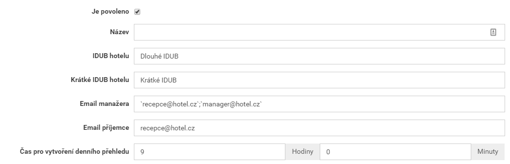
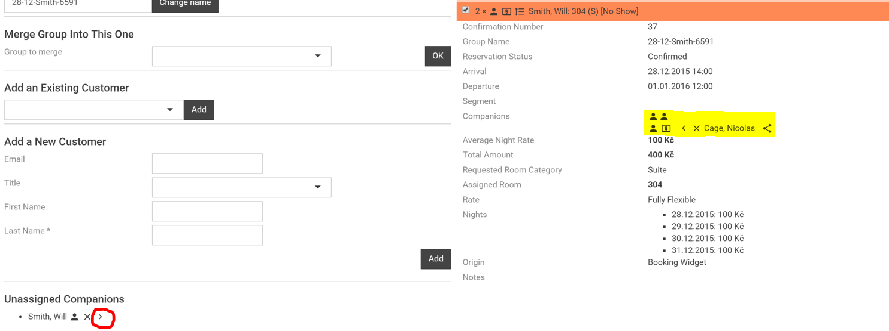

## Obsah

- [Úvod](#uvod)
- [Nastavení](#nastaveni)
	- [Příklad nastavení](#nastaveni-aktualizace)
- [Report Profily hostů](#report-profily-hostu)
   - [Neúplný report](#neuplny-report)
- [Jak automatický reporting funguje](#jak-vse-funguje)
   - [Co se děje v jeden den?](#jeden-den)
   - [Kteří hosté jsou reportováni](#kdo-je-reportovan)
- [UbyPort](#ubyport)
   - [Jak nahrát report](#jak-nahrat-report)
   - [Stanoviska Policie ČR](#stanoviska)
      - [Jak zacházet se Stanovisky](#jak-na-stanoviska)
- [Rady na závěr](#rady-na-zaver)

## Úvod

Tento dokument slouží jako návod hotelům pro oznamování ubytovaných cizinců Cizinecké Policii ČR. Základní informace, které poskytuje Policie ČR, jsou k dispozici [zde](http://www.policie.cz/clanek/oznamovani-ubytovanych-cizincu-ubytovatelem.aspx). **Tento dokument počítá s tím, že se přílušní hoteloví zaměstnanci s návodem Policie ČR seznámili**.

## Nastavení

Hotel musí zařídit sám:

- Zaregistrovat se u Cizinecké Policie ČR (viz jejich návod) a získat tak **IDUB** a **krátké IDUB** identifikátory hotelu a získat přístup do aplikace [UbyPort](https://ubyport.policie.cz). 

V Mews v *Integraci s cizineckou policií* je potřeba:

- Zadat `IDUB` a `krátké IDUB` - identifikátory hotelu v systému Policie ČR. 
- Zadat `Email příjemce` - emailovou adresu, na kterou bude Mews denně posílat kopii odeslaného reportu. **Je proto potřeba tuto emailovou schránku denně kontrolovat!**
- Zadat `Email manažera` - alespoň jednu emailovou adresu, na kterou bude Mews posílat připomínku pro kontrolu reportu [Profily hostů](#report-profily-hostu). **Je proto potřeba tuto emailovou schránku denně kontrolovat!** (Může to tedy být stejný email jako `Email příjemce`.)
- Nastavit čas generování reportu - doporučujeme nastavit 9:00, to poskytuje spoustu času vyřešit případné problémy s daty.

### Příklad nastavení

- Emailová adresa, na kterou bude Mews denně posílat report, je např. `recepce@hotel.cz`, tento email musí byt uveden v poli `Email příjemce`.
- Emailové adresa, na které chodí upozornení na vyplnění hotelu jsou např. `recepce@hotel.cz` a `manager@hotel.cz` v poli `Email manažera`.
   - Příjemci této zprávy jsou povinni **denně** kontrolovat, že data hostů v Mews jsou vyplněné.
   - Jednotlivé emailové adresy je třeba oddělit `;`.

## Report Profily hostů v Mews

Report [Profily hostů](#report-profily-hostu) je možné otevřít přímo z úvodní stránky po přihlášení do systému Mews. Report zobrazuje seznam hostů, kteří jsou ubytovaní (či kteří přijedou) ve vybraném časovém intervalu - záleží na zvolených parametrech reportu. Správný filtr pro report Policii je období na **1** den a mód `Příjezdy`.

Takto vypadá příklad reportu Profily hostů. Ukazuje, že na pokoji `203` jsou ubytováni `John Smith` a `Last Name` (host bez křestního jména), na pokoji `106` jsou ubytováni `Nicolas Cage`  a ještě někdo neudevený (rezervace je pro 2 osoby), na pokoji `206` je ubytována `Mena Suvari`. 

Dále report říká, že:

- Všechny potřebné údaje pro `John Smith` jsou vyplněny - *profil hosta je 100% vyplněn*.
- U ostatních hostů je potřeba doplnit údaje označené jako **Required**.
- Je potřeba zjistit, kdo je ubytován na pokoji 106 s `Nicolasem Cagem`.

Všechny chybějící (červené) údaje by ideálně měly být vyplněny již běhěm Check-in procesu. Pokud i po check-inu nějaké údaje chybí, musí být vyplněny do vygenerování reportu - viz [Jak automatický reporting funguje](#jak-vse-funguje). Cílem je mít report vyplněn na 100%. 

### Povinné údaje

- Jméno a příjmení
- Datum narození
- Národnost
- Adresa (alespoň Řádek 1, Město, PSČ a Stát)
- Číslo osobního dokladu
- Číslo víza je v reportu NEPOVINNÉ i přesto, že s některými zeměmi Česko udržuje vízovou povinnost. Pro tyto země je potřeba zacházet s tímto polem jako povinným.

*Poznámka:* V případě, že v reportu bude vybráno delší období než jeden den, report pro Policii bude vygenerován jen pro první den (Start).

### Neúplný report

Report [Profily hostů](#report-profily-hostu) nebývá vyplněn na 100% ani poté, co všichni hosté již přijeli. Pokud chybí nějaký údaj na profilu hosta (křestní jméno, národnost, datum narození, číslo cestovního dokladu nebo víza, adresa, ...), stačí se podívat do registrační karty hosta, kterou měl doplnit během check-inu, a údaje podle ní doplnit. Pokud ani tam údaje nejsou, znamená to, že na recepci při check-inu tyto údaje po hostovi nechtěli, přestože měli. Je potřeba hosta kontaktovat a údaje od něj zjistit. Dále je potřeba informovat recepci, aby při check-inu chtěly všchny údaje, aby se toto již neopakovalo.

Složitější problém na řešení je situace s neuvedeným hostem (případ pokoje `106`) - zvláště pro nováčky se systémem Mews. Mohlo nastat hned několik různých situací:

1. Druhý host nepřijede.
2. Druhý host přijel, ale nebyl v systému vytvořen.
4. Oba hosté přijeli, oba byli vytvořeni v systému, oba hosté jsou na detailu rezervace, přesto v reportu chybí host, na kterého byla rezervace vytvořena.

#### Řešení

1. Stačí ručně upravit rezervaci tak, aby byla jen pro jednoho hosta a případně aplikovat nějaké poplatky. 
2. Stačí vytvořit nového hosta a přiřadit jej k rezervaci.
3. Nejdříve je potřeba si uvědomit rozdíl mezi *vlastníkem* rezervace a *hostem* přiřazeným k rezervaci. *Vlastník* je ten, na jehož jméno je rezervace vytvořena. Může to být dokonce někdo, kdo do hotelu vůbec nepřijede, pouze pobyt pro někoho zarezervoval. *Host* je někdo, kdo přijel a kdo bydlí na daném pokoji. Názorně na obrázku:

Tento obrázek ukazuje, jak vyřešit třetí případ – pokoj `106` z prvního obrázku. `Nicolas Cage` je uveden jako *vlastník* rezervace. Je potřeba jej ještě přidat na pokoj kliknutím na `>` (označené červeně). Tím se host přidá na vybraný pokoj. Jeden host může totiž objednat více pokojů a systém jej automaticky nemůže přiřadit do všech zarezervovaných pokojů, protože jeden host nemůže být fyzicky ve dvou pokojích. Proto je potřeba vlastníka během Check-In procesu přiřadit do nějaké rezervace (udělat z něj hosta). Opět je potřeba nastavit na recepci check-in proces tak, aby se toto vyřešilo v den u příjezdu a nemuselo se to řešit zpětně.

## Jak reporting funguje

Pokud je na hotelu vše nastaveno, a schváleno Mews supportem, je vše připraveno pro oznamování cizinců ubytovaných v hotelu. Tato operace běží na pozadí systému Mews a vždy v 9 hodin ráno udělá dvě věci:

- Pošle upomínku na uvedený email s připomínkou, že je potřeba zkontrolovat report příjezdů za **včerejší** den.
- Vygeneruje se report za **předvčerejší** den a odešle jej hotelu na uvedený email v poli `Email příjemce`.

*Poznámka:* Před prvním spuštěním je potřeba mít na paměti, že se "bez upozornění" pošle report za **předevčerejší** den, ten je pořeba mít již zkontrolovaný.

### Co se děje v jeden den?

Nyní je **17.2.2014 9:00** a stanou se následující věci (využívá nastavení z [Příkladu nastavení](#nastaveni-priklad)):

- Mews pošle na uvedené adresy `recepce@hotel.com` a `manager@hotel.com` připomínku, že je potřeba zkontrolovat report [Profily hostů](#report-profily-hostu) za den **16.2.2014**. 
   - Je potřeba zkontrolovat, že report příjezdů v den **16.2.2014** je 100% (předpokládá se, že všichni hosté, kteří měli přijet **16.2.2014** již přijeli, proto se kontroluje „včerejší“ den). 
   - Pokud report není hotov na 100%, je potřeba tento report *během 24 hodin* co nejvíce dokončit ("zítra" jej totiž Mews vygeneruje a odešle hotelu v tom stavu, v jakém je).
- Mews vygeneruje report za „předvčerejší“ den **15.2.2014** (o kterém se předpokládá, že je zkontrolován z předchozího dne) a odešle jej na uvedený email (`recepce@hotel.cz`).
   - **Tento report je potřeba neprodleně nahrát v aplikaci [UbyPort](https://ubyport.policie.cz)** podle tohoto [návodu](#ubyport).
   - V současné době je potřeba nahrát report ručně. Policie pracuje na API, přes které bude moci Mews nahrávat report automaticky.       
- Policie ČR report zpracuje a vygeneruje [Stanovisko](#stanoviska) k reportu, které najdete přímo v aplikaci UbyPort.
   - Pokud Stanovisko říká, že data jsou v pořádku, pro tento den má hotel splněno.
   - Pokud je Stanovisko zamítavé, je potřeba report co nejdříve doplnit, znovu vygenerovat a znovu nahrát policii do systému [UbyPort](#ubyport).
      - viz [Jak zacházet se Stanovisky](#jak-na-stanoviska).

**Je proto důležité, aby všechny tyto emaily někdo každý den četl.**

*Poznámka:* Pokud hotel (na email `recepce@hotel.cz`) kolem deváté hodiny ranní neobdržel email s reportem (a není ani ve Spamu, ani omylem smazaný), je možné, že report neodešel - je třeba kontakovat Mews support. Problém může být jinde.

### Kteří hosté jsou reportováni

Podle zákona se mají Cizinecké Polici reportovat všichní hosté s jinou než českou národností. Takže Mews do reportu, který posílá Policii, zahrne každého hosta s vyplněnou národností (jinou, než českou) **a to bez ohledu na to, jestli má profil vyplněný na 100% nebo ne**. Je to z toho důvodu, že kdyby recepční vyplňovali report až po jeho odeslání a přišla na hotel kontrola, tak kniha hostů bude vykazovat mnohem více cizinců, než bylo nahlášeno Policii. Takže toto řešení donutí recepční vyplňovat vše včas. 

## UbyPort

Reporty vygenerované systémem Mews a zaslané hotelu na příslušnou adresu je třeba nahrát Policii [zde](https://ubyport.policie.cz).

### Jak nahrát report

### Stanoviska Policie ČR

**Stanovisko** je vyjádření Policie ČR k poslanému reportu a údajům v něm obsažených. **Stanovisko** může být:

- Všechna data v pořádku, oznamovací povinnost **BYLA** splněna.
- Chybí některé drobnosti (křestní jméno, datum narození, …), přesto oznamovací povinnost **BYLA** splněna.
- Byly detekovány závažné chyby, proto oznamovací povinnost **NEBYLA** splněna - **V tomto případě je potřeba rychle reagovat. Je proto důležité, aby uvedený email někdo každý den kontroloval a ujistil se, že chybějící data budou opravena a hned nahrána Policii do UbyPortu.**

#### Jak zacházet se Stanovisky

- Pokud je Stanovisko Policie ČR jedno z prvních dvou výše zmíněných případů, je vše v pořádku (v druhém případě je dobré opravit chybějící data v systému) a není potřeba nahrát opravený report. 
- Ve třetím případě je potřeba chyby opravit v systému a zároveň nahrát opravený report do UbyPortu - stačí v reportu [Profily hostů](#report-profily-hostu) vybrat příslušný den (**Pozor, stanoviska chodí na reporty poslané minimálně za 2 dny v minulosti** - viz [Jak automatický reporting funguje](#jak-vse-funguje)).

## Rady a připomínky na závěr

- Informovat všechny recepční, aby vyplňovali **všechny** potřebné údaje **při check-inu** (Jméno, Příjemní, Datum narození, Národnost, Číslo pasu a případně Víza, Adresu bydliště, ...) a správně **přiřadili všechny hosty na správný pokoj**.
- Je potřeba **denně** kontrolovat včerejší report.
- Je potřeba **denně** kontrolovat [Stanoviska](#stanoviska) Policie k jednotlivým reportům a v případě **zamítavého stanoviska** důsledně a co nejrychleji vyřešit chybějící údaje. 
- **Před prvním spuštěním** je potřeba zkontrolovat report za **poslední 2 dny (od data spuštění)**, protože na něj nepřijde upomínkový email.
- Hosté s uvedenou národností **jsou** reportováni **i pokud nemají vyplněné všechny potřebné údaje**.
- Tlačítko v reportu [Profily hostů](#report-profily-hostu) slouží **primárně** pro generování **opravného** reportu.
