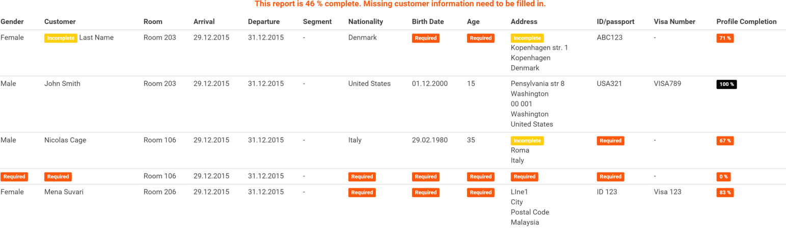

## Obsah

- [Úvod](#uvod)
- [Nastavení](#nastaveni)
	- [Aktualizace dat](#nastaveni-aktualizace)
	- [Příklad nastavení](#nastaveni-aktualizace)
- [Report Profily hostů](#report-profily-hostu)
   - [Neúplný report](#neuplny-report)
- [Jak automatický reporting funguje](#jak-vse-funguje)
   - [Co se děje v jeden den?](#jeden-den)
   - [Kteří hosté jsou reportováni](#kdo-je-reportovan)
- [Stanoviska Policie ČR](#stanoviska)
   - [Jak zacházet se Stanovisky](#jak-na-stanoviska)
- [Rady na závěr](#rady-na-zaver)
- [Informace od Policie ČR](#informace-policie-cr)

## Úvod

Tento dokument slouží jako návod hotelům pro používání Automatického oznamování cizinců Cizinecké Policii ČR. Základní informace, které poskytuje Policie ČR, jsou k dispozici [zde](http://e-uby.wz.cz/INFORMACE.htm). Tento dokument počítá s tím, že se přílušní zaměstnanci s návodem Policie ČR seznámili.

## Nastavení

Hotel musí zařídit sám:

- Získat certifikát (digitální podpis) pro emailovou adresu hotelu - policie tím bude ověřovat přijaté emaily s reporty. Může to být přímo email hotelu, nebo nějakého zaměstnance, nebo speciálně vytvořená adresa (třeba `cizineckapolicie@hotel.com`). Jen je potřeba vzít v potaz, že asi nebude jednoduché adresu změnit v budoucnu.
- Zaregistrovat se u Cizinecké Policie ČR (viz jejich návod) a získat tak **IDUB** a **krátké IDUB** identifikátory hotelu a propojit hotel s emailovou adresou s digitálním podpisem.
- Zjistit seriové číslo certifikátu a jméno vydavatele certifikátu (měla by být uvdena v emailu, ve kterém dostanete elektronický podpis). **Tuto informaci je potřebné v Mews aktualizovat s každým novým certifikátem.** 

V Mews v *Integraci s cizineckou policií* je potřeba:

- Zadat **IDUB** a **krátké IDUB** identifikátory hotelu.
- Zadat tuto digitálně podepsanou emailovou adresu, pod kterou je hotel zaregistrován u Policie ČR. Na tento email bude Mews denně posílat kopii odesaného reportu a Policie ČR na tuto adresu bude posílat [Stanoviska](#stanoviska) k jednotlivým odeslaným reportům. **Je proto potřeba tuto emailovou schránku denně kontrolovat!**
- Zadat alespoň jednu emailovou adresu, na kterou bude Mews posílat připomínku pro kontrolu reportu [Profily hostů](#report-profily-hostu). **Je proto potřeba tuto emailovou schránku denně kontrolovat!** (Může to tedy být stejný email.)
- Nahrát certifikát - digitální podpis - aby jej Mews mohlo posílat Policii pro ověření odeslaného reportu (*My jsme si to nevymysleli :)*).
- Zadat seriové číslo certifikátu a jméno vydavatele certifikátu.

### Aktualizace dat
Certifikát (=digitální podpis) je vydáván s omezenou platností. Prodloužení se řeší vydáním nového certifikátu. Pokud se tak stane, je potřeba nový certifikát nahrát do Mews a aktualizovat jeho seriové číslo. To samé platí, pokud hotel změní vydavatele certifikáty - v tom případě je potřeba správně přenatavit i jméno vydavatele certifikátu.

Jak to akualizovat:

1. Kliknout na `Vybrat` (certifikát) v pravé části obrazovky a vybrat certifikát (=digitální podpis).
2. Kliknout na tlačítko `Nahrát`, tím se certifikát nahraje do Mews.
3. Vyplnit pole `Sériové číslo certifikátu` (7 číslic, na obrázku je to špatně) a `Vydavatel certifikátu` podle údajů z emailu s obdrženým ertifikátem.
4. Klinout na `Uložit`, aby se údaje uložily v Mews.

### Příklad nastavení

- Emailová adresa, na kterou hotel zařídil digitální podpis a pod kterým je hotel zaregistrován v systému Policie ČR je `cizineckapolicie@hotel.cz`, tento email musi byt uveden v poli `Email odesílatele`.
- Emailové adresa, na které chodí upozornení na vyplnění hotelu jsou `recepce@hotel.cz` a `manager@hotel.cz`, příjemci této zprávy jsou povini **denně** kontrolovat, že reporty jsou vyplněné.
- Adresa emailu policie je `ubytovani@pcr.cz`, na tuto adresu bude chodit report cizinců, přidáním emailu `manager@hotel.cz` do pole `Email příjemce`, bude kopie reportu chodit i na tuto adresu. *Pokud v poli `Email příjemce` nebude správná adresa police, email na ní nebude poslán.*
- Pole `Sériové číslo certifikátu` a `Vydavatel certifikátu` je potřeba nastavit společně s nahráním certifikátu a pravidelně vše aktualizovat.

## Report Profily hostů v Mews
Report Profily hostů (*Customer Profiles*) je možné otevřít přímo z úvodní stránky po přihlášení do systému Mews. Report zobrazuje seznam hostů, kteří jsou ubytovaní (či kteří přijedou) ve vybraném časovém intervalu - záleží na zvolených parametrech reportu. Správný filtr pro report je období na den a mód "Příjezdy".

Takto vypadá příklad reportu Profily hostů. Ukazuje, že na pokoji `203` jsou ubytováni `John Smith` a `Last Name` (host bez křestního jména), na pokoji `106` jsou ubytováni `Nicolas Cage`  a ještě někdo neudevený (rezervace je pro 2 osoby), na pokoji `206` je ubytována `Mena Suvari`. 

Dále report říká, že:

- Všechny potřebné údaje pro `John Smith` jsou vyplněny - *profil hosta je 100% vyplněn*.
- U ostatních hostů je potřeba doplnit údaje označenéjako **Required**.
- Je potřeba zjistit, kdo je ubytován na pokoji 106 z Nicolasem Cagem.

Všechny chybějící (červené) údaje měly být vyplněny již běhěm Check-in procesu. Pokud i po check-inu nějaké údaje chybí, musí být vyplněny do odeslání reportu - viz [Jak automatický reporting funguje](#jak-vse-funguje). Cílem je mít report vyplněn na 100%. 

### Povinné údaje
- Jméno a příjmení
- Datum narození
- Národnost
- Adresa (alespoň Řádek 1, Město, PSČ a Stát)
- Číslo osobního dokladu
- Číslo víza je v reportu NEPOVINNÉ, přestože s některými zeměmi Česko udržuje vízovou povinnost. Pro tyto země je potřeba zacházet s tímto polem jako povinným.

*Poznámka:* Je možné stáhnout si report pro vybraný den nebo jej přímo odeslat (opravený) rovnou Policii - viz [Rady na závěr](#rady-na-zaver). V případě, že v reportu bude vybráno delší období než jeden den, report bude v obou případech vygenerován jen pro první den (Start).

### Neúplný report

Report [Profily hostů](#report-profily-hostu) nebývá vyplněn na 100% ani poté, co všichni hosté již přijeli. Pokud chybí nějaký údaj na profilu hosta (křestní jméno, národnost, datum narození, číslo cestovního dokladu, adresa, ...), stačí se podívat do registrační karty hosta, kterou měl doplnit během check-inu, a údaje podle ní doplnit. Pokud ani tam údaje nejsou, znamená to, že na recepri při check-inu tyto údaje po hostovi nechtěli, přestože měli. Je potřeba hosta kontaktovat a údaje od něj zjistit. Dále je potřeba informovat recepci, aby při check-inu chtěly všchny údaje, aby se toto již neopakovalo.

Složitější problém na řešení je situace s neuvedeným hostem (případ pokoje `106`) - zvláště pro nováčky se systémem Mews. Mohlo nastat hned několik různých situací:

1. Druhý host nepřijede.
2. Druhý host přijel, ale nebyl v systému vytvořen.
4. Oba hosté přijeli, oba byli vytvořeni v systému, oba hosté jsou na detailu rezervace, přesto v reportu chybí host, na kterého byla rezervace vytvořena.

#### Řešení

1. Stačí ručně upravit rezervaci tak, aby byla jen pro jednoho hosta a případně aplikovat nějaké poplatky. 
2. Stačí vytvořit nového hosta a přiřadit jej k rezervaci.
3. Nejdříve je potřeba si uvědomit rozdíl mezi *vlastníkem* rezervace a *hostem* přiřazeným k rezervaci. *Vlastník* je ten, na jehož jméno je rezervace vytvořena. Může to být dokonce někdo, kdo do hotelu vůbec nepřijede, pouze pobyt pro někoho zarezervoval. *Host* je někdo, kdo přijel a kdo bydlí na daném pokoji. Názorně na obrázku:

Tento obrázek ukazuje, jak vyřešit třetí případ – pokoj `106` z prvního obrázku. `Nicolas Cage` je uveden jako *vlastník* rezervace. Je potřeba jej ještě přidat na pokoj kliknutím na `>` (označené červeně). Tím se host přidá na vybraný pokoj. Jeden host může totiž objednat více pokojů a systém jej automaticky nemůže přiřadit do všech zarezervovaných pokojů, protože jeden host nemůže být fyzicky ve dvou pokojích. Proto je potřeba vlastníka během Check-In procesu přiřadit do nějaké rezervace (udělat z něj hosta). Opět je potřeba nastavit na recepci check-in proces tak, aby se toto vyřešilo v den u příjezdu a nemuselo se to řešit zpětně.

## Jak automatický reporting funguje

Pokud je na hotelu vše nastaveno, a schváleno Mews supportem, je vše připraveno pro automatické oznamování cizinců ubytovaných v hotelu. Tato operace běží na pozadí systému Mews a vždy v 9 hodin ráno udělá dvě věci:

- Pošle upomínku na uvedený email s připomínkou, že je potřeba zkontrolovat report příjezdů za **včerejší** den.
- Vygeneruje se report za **předvčerejší** den a odešle jej Policii ČR.

*Poznámka:* Před prvním spuštěním je potřeba mít na paměti, že se "bez upozornění" pošle report za **předevčírem**, ten je pořeba mít již zkontrolovaný. Dobrým dnem pro spuštění automatického reportování je tedy 3. den v měsíci, protože první odeslaný report je za první den v měsíci - to jen pro jednoduchou kontrolu, do kdy hotel posílá reporty ručně.

### Co se děje v jeden den?

Nyní je **17.2.2014 9:00** a stanou se následující věci (využívá emaily z [Příkladu nastavení](#nastaveni-priklad)):

- Mews pošle na uvedené adresy `recepce@hotel.com` a `manager@hotel.com` připomínku, že je potřeba zkontrolovat report [Profily hostů](#report-profily-hostu) za den **16.2.2014**. 
   - Je potřeba zkontrolovat, že report příjezdů v den **16.2.2014** je 100% (předpokládá se, že všichni hosté, kteří měli přijet **16.2.2014** již přijeli, proto se kontroluje „včerejší“ den). 
   - Pokud report není hotov na 100%, je potřeba tento report *během 24 hodin* co nejvíce dokončit ("zítra" jej totiž Mews automaticky odešle Policii v tom stavu, v jakém je).
- Mews automatiky vygeneruje report za „předvčerejší“ den **15.2.2014** (o kterém se předpokládá, že je zkontrolován z předchozího dne) a pošle Policii ČR a v kopii na uvedený email `hotel@hotel.com`. 
- Policie ČR report zpracuje a pošle na adresu (tu digitálně podepsanou) své [Stanovisko](#stanoviska) k reportu. Většinou to posílají ještě ten den, nejpozději do druhého pracovního dne.

**Je proto důležité, aby oba 2 tyto emaily někdo každý den četl a ujistil se, že Policie report přijala.**

*Poznámka:* Pokud hotel (na email `hotel@hotel.com`) kolem deváté hodiny ranní neobdržel kopii reportu odeslaného Policii (a není ani ve Spamu, ani omylem smazaný). Je možné, že report neodešel - je třeba kontakovat Mews support (dříve než report odešlete sami ručně). Problém může být jinde.

### Kteří hosté jsou reportováni

Podle zákona se mají Cizinecké Polici reportovat všichní hosté s jinou než českou národností. Takže Mews do reportu, který posílá Policii, zahrne každého hosta s vypněnou národností (jinou, než českou) **a to bez ohledu na to, jestli má profil vyplněný na 100% nebo ne**. Je to z toho důvodu, že kdyby recepční vyplňovali report až po jeho odeslání a přišla na hotel kontrola, tak kniha hostů bude vykazovat mnohem více cizinců, než bylo nahlášeno Policii. Takže toto řešení donutí recepční vyplňovat vše včas. 

## Stanoviska Policie ČR
**Stanovisko** je vyjádření Policie ČR k poslanému reportu a datum v něm obsažných. **Stanovisko** může být:

- Všechna data v pořádku, oznamovací povinnost **BYLA** splněna.
- Chybí některé drobnosti (křestní jméno, datum narození, …), přesto oznamovací povinnost **BYLA** splněna.
- Byly detekovány závažné chyby, proto oznamovací povinnost **NEBYLA** splněna - **V tomto případě je potřeba rychle reagovat. Je proto důležité, aby uvedený email někdo každý den kontroloval a ujistil se, že chybějící data budou opravena a hned poslána Policii zpět.**

### Jak zacházet se Stanovisky

- Pokud je Stanovisko Policie ČR jedno z prvních dvou výše zmíněných případů, je vše v pořádku (v druhém případě je dobré opravit chybějící data v systému) a není potřeba posílat opravený report. 
- Ve třetím případě je potřeba chyby opravit v systému a zároveň poslat opravený report - stačí v reportu [Profily hostů](#report-profily-hostu) vybrat příslušný den (**Pozor, stanoviska chodí na reporty poslané minimálně za 2 dny v minulosti** - viz [Jak automatický reporting funguje](#jak-vse-funguje)).

## Rady a připomínky na závěr

- Informovat všechny recepční, aby vyplňovali **všechny** potřebné údaje **při check-inu** (Jméno, Příjemní, Datum narození, Národnost, Číslo pasu a Adresu bydliště) a správně **přiřadili všechny hosty na správný pokoj**.
- Je potřeba **denně** kontrolovat včerejší report.
- Je potřeba **denně** kontrolovat [Stanoviska](#stanoviska) Policie k jednotlivým reportům a v případě **zamítavého stanoviska** důsledně a co nejrychleji vyřešit chybějící údaje. 
- Před prvním spuštění je potřeba zkontrolovat report za **poslední 2 dny (od data spuštění)**, protože na něj nepřijde upomínkový email.
- Hosté s uvedenou národností **jsou** reportováni **s nevyplněnými dalšími údaji**.
- Tlačítko v reportu [Profily hostů](#report-profily-hostu) pro odeslání reportu slouží **primárně** pro posílání **opravného** reportu Policii, *sekundárně* pro poslání reportu, pokud ho *Mews neodeslal automaticky *- to ale musí **potvrdit Mews support**.

## Informace od Policie ČR
- Na [této adrese](http://e-uby.wz.cz/INFORMACE.htm) poskytuje Policie ČR informace pro uživatele systému **Oznamování cizinců ubytovateli**. 
- Zejména je vhodné seznámit se s články: 
   - Informace: 000, 006, 007 
   - FAQ: 008, 013, 016
